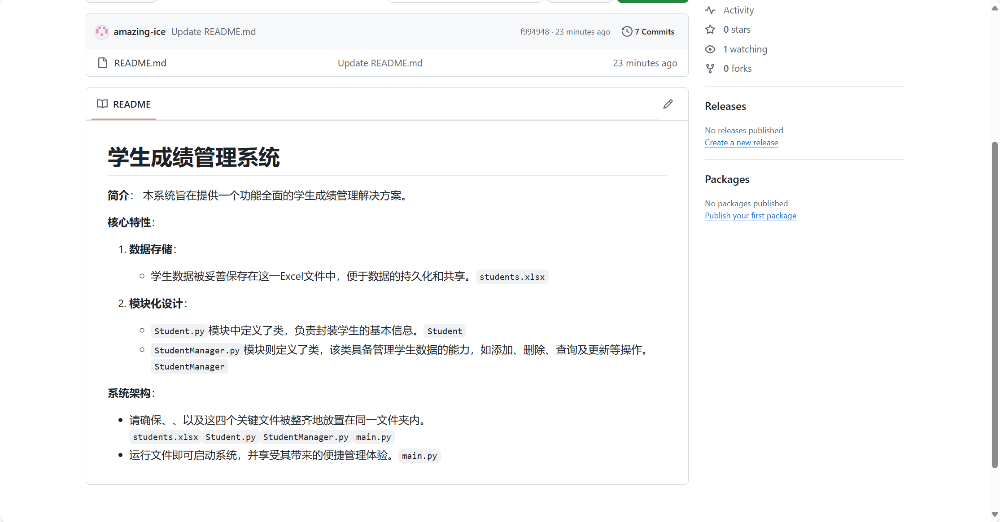
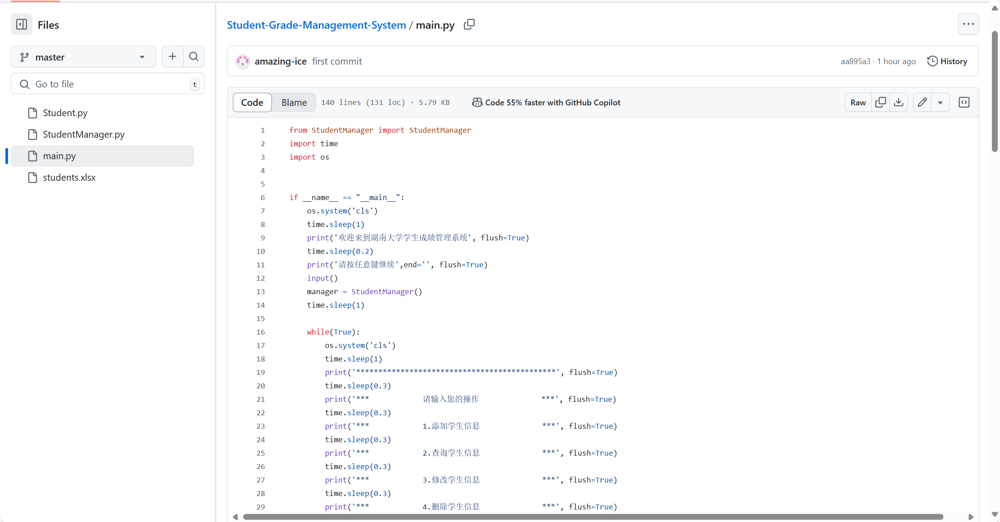
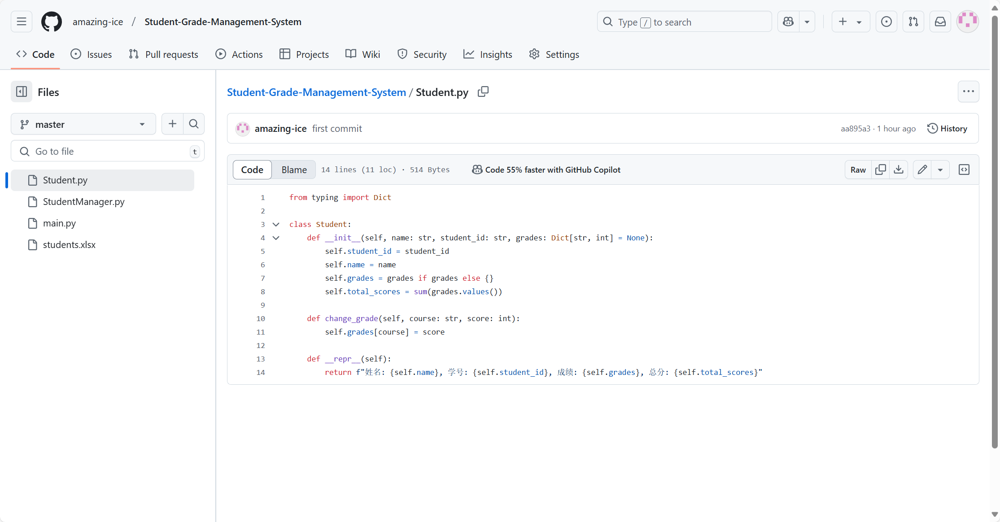
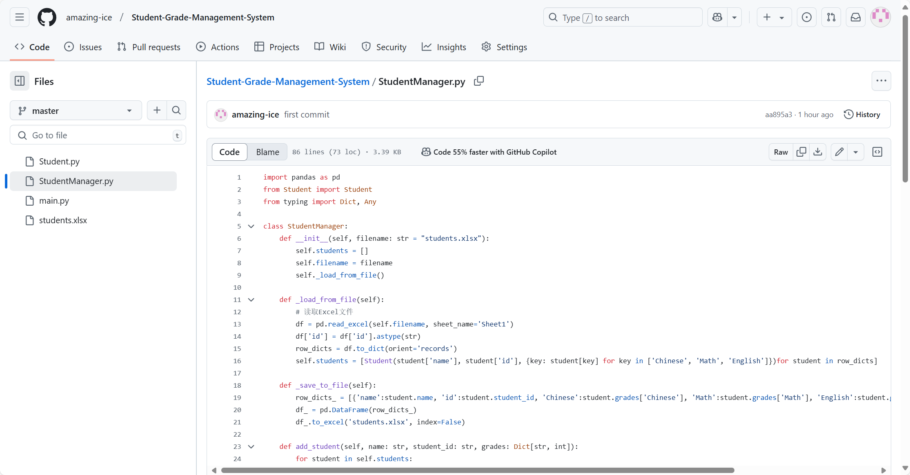
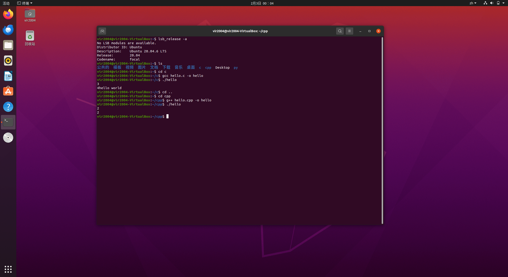
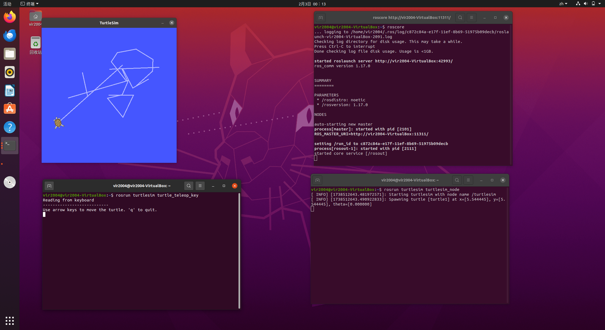
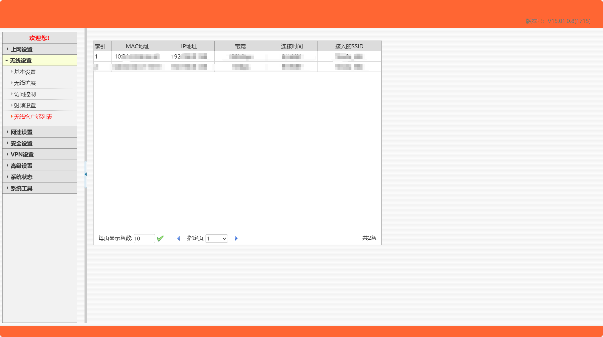
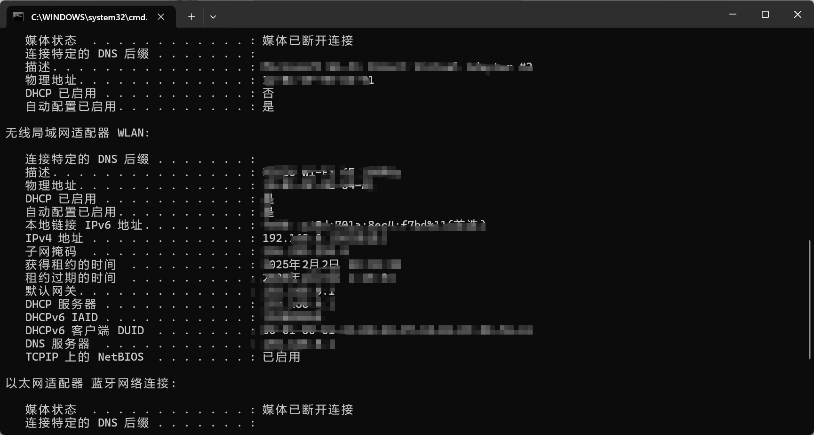

# Week-1 编程技能学习报告

## 学生基本信息

- **姓名**：谢滨冰
- **专业班级**：计科（智能）2302
- **学号**：202301200217
- **联系方式**
  - **QQ**：2326361255
  - **电话**：17373109972

---

## 1. 学生成绩管理系统开发

### 系统功能截图展示

#### README

#### 主页面

#### Student类

#### StudentManager类

---

## 2. Ubuntu 安装

**安装版本**：Ubuntu 20.04

**事件**： 

- 熟悉命令行指令ls、cd
- 使用Vim
- 通过 apt 下载软件、删除软件
- 更换系统源
- 能运用 gcc 指令编译 C 语言文件，g++ 编译 C++文件，能运行 python 文件
- 了解 .bashrc 文件，会配置环境变量

---

## 3. ROS（Robot Operating System）安装

---

## 4. 计算机基础知识与网络基础实践

### 进入路由器后台管理

### 使用CMD命令查看网络信息

---

## 5. Git和GitHub仓库使用

- **仓库地址**：[Student-Grade-Management-System](https://github.com/amazing-ice/Student-Grade-Management-System.git)